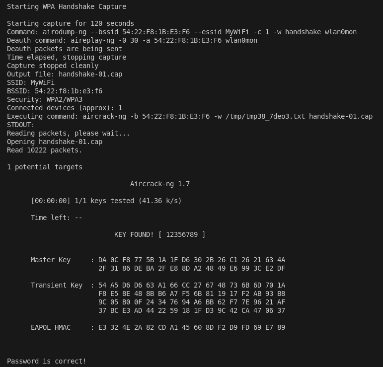
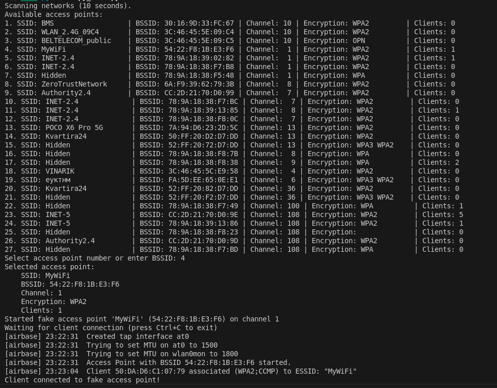

# Курсовая работа

## Первая подзадача
Первая подзадача заключается в извлечении хеша (handshake) из файла с захваченным трафиком и последующей проверке пароля с помощью утилиты aircrack-ng: сравнивается хеш пароля с заданной строкой.

## Вторая подзадача (папка check_password)
Вторая подзадача состоит в автоматизации записи трафика для указанной точки доступа и дальнейшем использовании результатов первой подзадачи (проверка пароля).
В папке check_password в подкаталоге  1 находится трафик, записанный вручную с помощью команды:
```bash
sudo airodump-ng --bssid 54:22:F8:1B:E3:F6 -c 1 --essid "MyWiFi" -w handshake wlan0mon
```
В подкаталоге  2 — находится трафик, который записан при помощи программы.

Результат выполнения программы представлен на скриншоте:


## Третья подзадача (папка copy_wifi)
Третья подзадача включает вывод списка доступных точек доступа, выбор пользователем цели и создание поддельной точки доступа с теми же SSID и BSSID, но без пароля. Поддельная точка работает до первого подключившегося клиента.
В папке copy_wifi находится трафик, записанный вручную с помощью команды:
```bash
sudo airodump-ng --bssid 54:22:F8:1B:E3:F6 -c 1 --essid "MyWiFi" -w handshake wlan0mon
```
Результат выполнения программы представлен на скриншоте:


## Подготовка интерфейса
Перед запуском программы переведите интерфейс wlan0 в режим мониторинга:

```bash
sudo airmon-ng check kill
```
```bash
sudo airmon-ng start wlan0
```
Проверьте, успешно ли выполнен переход:
```bash
iwconfig
```
После завершения работы программы восстановите обычный режим работы сети:
```bash
sudo airmon-ng stop wlan0mon
```
```bash
sudo systemctl restart NetworkManager
```
